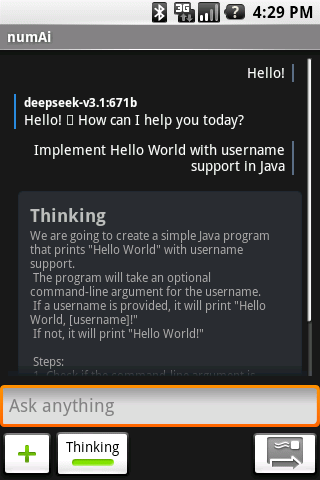
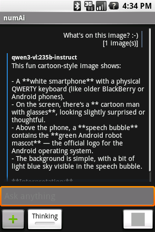
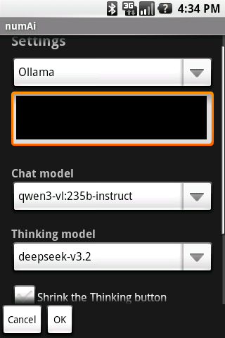

# numAi
[English](README.md) / **русский**

Простое ИИ-приложение для **Android 1.0+** с поддержкой глубокого мышления, восприятия изображений и множества API. Доступ к ChatGPT, DeepSeek, Gemini, Grok, Qwen, GLM и другим нейросетям в одном простом приложении.

  
* **Telegram-канал по проекту**: [@AppDataApps](https://t.me/AppDataApps)
* Telegram-группа по старым андроидам **[Retro Android](https://t.me/retroandroidgroup/12889)**

## 📥 Скачать
* [GitHub Releases](https://github.com/gohoski/numAi/releases) *(рекомендуется)*
* Telegram (ссылка выше)

> [!IMPORTANT]  
> Приложение разработано для Android <10, поэтому на более новых версиях оно может работать нестабильно или отображаться некорректно. Однако вы всё равно можете сообщать о проблемах на более новых версиях Android.

## Возможности
* Поддержка различных API и моделей, которые используют формат API OpenAI (т. е. большинство LLM-API)
* Режим мышления (переключение между моделью для общения и для размышлений)
* Восприятие изображений
* Возможность изменить системный промпт
### TODO
* Поддержка Markdown-форматирования
* Прикрепление файлов
* Удобный импорт API-ключа из файла

## Сообщить о баге
**Вам во вкладку «[Issues](https://github.com/gohoski/numAi/issues)» на GitHub!** Не забудьте уточнить, на какой версии Android вы встретили баг.

## Рекомендуемые модели
<small>На момент декабря 2025 для Ollama</small>
* Модель общения — `deepseek-v3.1` или `qwen3-vl-235b-instruct` если нужно восприятие изображений
* Модель мышления — `deepseek-v3.2` или `gemini-3-pro` (имеет жёсткие лимиты) или `qwen3-vl-235b` если нужно восприятие изображений

<small>На момент декабря 2025 для VoidAI</small>
* Модель общения — `deepseek-v3.2` или `gemini-3-flash` если нужно восприятие изображений
* Модель мышления — `gemini-3-pro` или `glm-4.7`
### Примечания
* Только vision-модели поддерживают изображения — если изображение не обрабатывается нейросетью, попробуйте переключить модель на, например, Qwen3-VL-235B, Gemini 3 или GPT-5 mini.
* Модели с `Instruct` в названии поддерживают только общение без мышления, а модели с `Thinking` — только режим мышления. Некоторые модели поддерживают либо только мышление (например, MiniMax M2 и Gemini 3 Pro), либо только общение, поэтому при неправильном выборе могут быть неполадки в отображении — выбирайте модель правильно.
* Gemini выдаёт текст медленно и иногда не показывает процесс мышления. Это особенность API из-за решений Google.

## Инструкция по получению API-ключа
У всех перечисленных ниже API есть бесплатные квоты — платить не нужно.
### VoidAI (Android 2.3+)
> [!TIP]  
> Если имеется Discord-аккаунт, рекомендуется попробовать [NavyAI](https://api.navy), поскольку он имеет больше моделей. Однако он тоже использует Cloudflare (см. далее).

> [!WARNING]  
> Этот API использует Cloudflare, что делает его недоступным для Android 1.0–2.2. Подробнее см. [«Почему есть ограничения на Android 2.2 и ниже?»](#почему-есть-ограничения-на-android-22-и-ниже).

1. В современном браузере перейдите на [voidai.app/register](https://voidai.app/register) и создайте аккаунт.
2. После входа в систему перейдите в раздел **API Keys** в dashboard.
3. Нажмите **Generate New API Key**.
4. Скопируйте появившийся ключ и перенесите его на своё устройство.

### Ollama Cloud
> [!TIP]  
> Этот API не использует Cloudflare и **рекомендован к использованию** на Android 1.0–2.2. У этого провайдера также есть vision-модели (модели, которые могут «видеть» изображения; `Qwen3-VL-235B`).

1. В современном браузере перейдите на [signin.ollama.com/sign-up](https://signin.ollama.com/sign-up) и создайте аккаунт.
2. После входа в систему перейдите на [ollama.com/settings/keys](https://ollama.com/settings/keys).
3. Нажмите **Add API Key**, затем **Generate API Key**.
4. Скопируйте ключ и перенесите его на своё устройство. Вместо VoidAI выберите Ollama в выпадающем меню.

### Baseten
*Этот API не использует Cloudflare и доступен на всех версиях Android.* Однако зарегистрироваться здесь может быть сложнее из-за возможной необходимости **ручного одобрения** вашей учётной записи командой Baseten. У этого провайдера нет vision-моделей.
1. В современном браузере перейдите на [app.baseten.co/signup](https://app.baseten.co/signup?next=/) и создайте аккаунт. **Рекомендуется регистрироваться через соцсети** (GitHub/Google), чтобы снизить вероятность появления всплывающего окна «We need more information to approve your account» — однако, если оно появится, попробуйте отправить заявку со своей информацией и ждите ответа.
2. После входа в систему перейдите на [app.baseten.co/model-apis/create](https://app.baseten.co/model-apis/create), выберите любую модель и нажмите **Add new Model API**.
3. На следующем экране нажмите **View API endpoint**, затем **Generate API key**.
4. Скопируйте ключ и перенесите его на своё устройство. Вместо VoidAI выберите Baseten в выпадающем меню.

### Почему есть ограничения на Android 2.2 и ниже?
Cloudflare и некоторые другие сетевые сервисы блокируют запросы от Java 5 с TLS 1.0, потому что их системы TLS fingerprinting считают такие запросы подозрительными. Поскольку Android 1.0–2.2 используют Java 5, а большинство ИИ-сервисов используют такие сетевые службы, вы можете не подключиться к ним. Android 2.3–4.4 используют Java 6, поэтому там проблем нет. Такие же блокировки происходят с Java 5 и на ПК, так что это не специфически проблема Android. Странно, но вы либо получаете страницу *403 Forbidden*, либо handshake Client Hello вообще сбрасывается. Проблема не в сертификатах или подобном, так как мы их игнорируем в нашем коде *(хоть это и небезопасно, сомневаюсь, что кто-то будет целенаправленно атаковать бесплатный LLM-API сервис)*.

Точная причина, по которой запросы из Java 5 блокируются, пока мне неизвестна, поскольку поддержка TLS 1.0 присутствует и работает с cURL и Java 6. Известно, что не все хостинги и сетевые сервисы пока применяют такие блокировки, поэтому Ollama, Baseten и Upstage, которые размещены на Google Cloud и Amazon Web Services, спокойно работают на Android <=2.2.

Есть только два способа решить эту проблему:
1. Попытаться скомпилировать OpenSSL/wolfSSL/??? для поддержки TLS 1.2. Однако это резко увеличит сложность сборки этого проекта и не нужно, так как всё ещё есть ИИ-сервисы, работающие на Java 5. *Пока что я буду отклонять любые PR, реализующие это.*
2. **Настроить HTTPS -> HTTP реверс-прокси, например, на nginx.** Это рекомендованное и выполнимое решение для любого, у кого есть VPS. Однако, что делать людям без VPS, неясно. *Если кто-то решит его разместить, свяжитесь со мной, чтобы я мог добавить ваш прокси-сервер, но он должен быть стабильным.*

## Сборка
Проект разрабатывается в таком формате:
* Android Studio 2.3.2 [`Download`](https://developer.android.com/studio/archive)
  * Android Studio 1.0–3.1.2 могут поддерживать Android <2.2, но 2.3.2 рекомендуется для разработки, так как она одновременно старая и поддерживаемая.
  * Последние версии AS всё ещё поддерживают Android 2.2 и новее, хоть и рассчитаны на минимум 4.1 — вы можете использовать их, если вам не важна поддержка старых версий Android.
* Android SDK любой версии *(рекомендуется 25)*
  * Для разработки приложений под старые версии не обязательно использовать старый SDK.
* Android 1.0 emulator из SDK [`Download`](https://developer.android.com/sdk/older_releases#release-1.0-r1)

При внесении вклада в проект рекомендуется использовать AS; однако вы можете использовать другую IDE, при условии, что проект останется пригодным для использования в AS.

## Благодарности
* [How-to-develop-and-backport-for-Android-2.1-in-2020](https://github.com/Mik-el/How-to-develop-and-backport-for-Android-2.1-in-2020) — шаблон проекта от Микеле
* [NNJSON](https://github.com/shinovon/NNJSON) — библиотека от nnproject
* Упрощённая реализация [Base64](app/src/main/java/io/github/gohoski/numai/Base64.java) основана на коде [Роберта Хардера](https://iharder.sourceforge.net/current/java/base64/), находящемся в общественном достоянии
* [ReOldAI от YMP Yuri](https://github.com/YMP-CO/ReOldAi) — хотя это похожее приложение, использующее API Gemini, не служило источником вдохновения или кодовой базой, оно послужило мотивацией для проекта
## Лицензия
Проект **numAi** распространяется по лицензии Do What The Fuck You Want To Public License версии 2. Подробнее см. [LICENSE](LICENSE). *Если хотите, можете указать меня в README вашего проекта.*  

ОДНАКО, библиотека NNJSON распространяется по лицензии MIT. Подробнее см. [LICENSE-NNJSON](LICENSE-NNJSON).