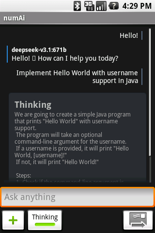
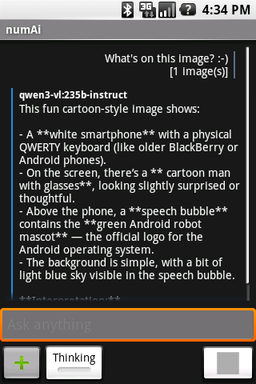
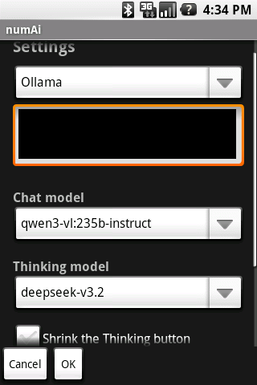

# numAi
[English](README.md) / **русский** / [简体中文](README.zh.md)

ИИ-приложение, совместимое с **Android 1.0+**, с поддержкой глубокого мышления, восприятия изображений и веб-поиска. Получите доступ к ChatGPT, DeepSeek, Gemini, Qwen, GLM, Kimi и другим нейросетям в одном простом приложении на вашем старом устройстве.
* **Telegram-канал с обновлениями**: [@AppDataApps](https://t.me/AppDataApps)
* Заходите в наш чат **[Retro Android Group](https://t.me/retroandroidgroup)** в Telegram!
* Discord-сервер: [Android Afterlife](https://discord.gg/2JqfEkQyck)

       

## 📥 Скачать
* [GitHub Releases](https://github.com/gohoski/numAi/releases)
* [4PDA](https://4pda.to/forum/index.php?showtopic=1116157)
* Telegram (ссылка в начале README)

## Возможности
* Поддержка различных API и моделей, совместимых с форматом OpenAI (т. е. большинства API LLM)
* Режим мышления (переключение между чат-моделью и моделью мышления)
* Vision (прикрепление изображений)
* Возможность изменения системного промпта
* Импорт API-ключа из файла
* Поддержка форматирования Markdown (включая таблицы)
* Веб-поиск через Bing (Android 1.0+, рекомендуется) и DuckDuckGo (Android 1.6+, требуется Wolfius, может быть ограничен)
* Веб-фетчинг / загрузка страниц (Android 1.6+, требуется [Wolfius](https://github.com/gohoski/Wolfius))
### TODO
* Прикрепление файлов

## Рекомендуемые модели
> [!WARNING]  
> Не все модели поддерживают зрение (vision). Пожалуйста, заранее проверьте, поддерживает ли модель прикрепление изображений нативно.
### VoidAI
* Модель для чата: `deepseek-v3.2` (или `gemini-3.5-flash-lite`/`kimi-k3` для vision)
* Модель для мышления: `deepseek-v4-flash` (или `gemini-3.6-flash`/`kimi-k3` для vision)
### Ollama Cloud
* `gemma4:31b` — поддерживает чат, мышление и восприятие изображений
### OpenCode Zen
* `deepseek-v4-flash-free` — поддерживает только чат и мышление. Для восприятия изображений используйте другой API.

## Сообщения об ошибках
**Сообщайте об ошибках во вкладке [Issues](https://github.com/gohoski/numAi/issues)!** Не забудьте указать, на какой версии Android вы столкнулись с багом.

## Руководство по настройке API-ключей
Все приведенные ниже API имеют бесплатные лимиты — оплата не требуется.
### VoidAI (Android 1.6+)
> [!WARNING]  
> Для корректной работы этого API на Android <3.0 требуется [Wolfius](https://github.com/gohoski/Wolfius).

1. В современном браузере перейдите на [voidai.app/register](https://voidai.app/register) и создайте аккаунт.
2. После входа перейдите в раздел **API Keys** в вашей панели управления.
3. Нажмите **Generate New API Key**.
4. Скопируйте появившийся ключ и перенесите его на своё устройство.

### Ollama Cloud
> [!TIP]  
> Этот API рекомендуется использовать на Android 1.0+, так как он всё еще поддерживает TLS 1.0 без SNI.

1. В современном браузере перейдите на [ollama.com](https://ollama.com/) и создайте аккаунт.
2. После входа перейдите на [ollama.com/settings/keys](https://ollama.com/settings/keys).
3. Нажмите **Add API Key**, затем **Generate API Key**.
4. Скопируйте ключ и перенесите его на устройство. Выберите Ollama Cloud в выпадающем меню вместо VoidAI.

### OpenCode Zen (Android 1.6+)
> [!WARNING]  
> Для корректной работы этого API на Android <4.4 требуется [Wolfius](https://github.com/gohoski/Wolfius).

1. В современном браузере перейдите на [opencode.ai/auth](https://opencode.ai/auth) и создайте аккаунт.
2. После входа перейдите в раздел **API Keys** в вашей панели управления.
3. Нажмите **Create API Key** и введите любое название ключа.
4. Скопируйте появившийся ключ и перенесите его на своё устройство.

## Сборка
Проект разрабатывается в следующей среде:
* Android Studio 2.3.2 [`Скачать`](https://developer.android.com/studio/archive)
  * Android Studio 1.0–3.1.2 может поддерживать Android <2.2, но 2.3.2 рекомендуется для разработки, так как она одновременно старая и поддерживаемая.
  * Последние версии AS по-прежнему поддерживают Android 2.2 и выше (хотя создавались с расчетом на 4.1+) — вы можете использовать их, если поддержка совсем старых версий Android не является приоритетом.
* Android SDK любой версии *(рекомендуется 25)*
  * Использовать старый SDK для разработки приложений под устаревшие системы не обязательно.
* Эмулятор Android 1.0 из SDK [`Скачать`](https://developer.android.com/sdk/older_releases#release-1.0-r1)

При внесении вклада в проект рекомендуется использовать AS; однако вы можете использовать и другую IDE, если проект останется работоспособным в AS.

## Благодарности
* Шаблон проекта [How-to-develop-and-backport-for-Android-2.1-in-2020](https://github.com/Mik-el/How-to-develop-and-backport-for-Android-2.1-in-2020) от Michele
* Библиотека [NNJSON](https://github.com/shinovon/NNJSON) от nnproject
* [ReOldAI от YMP Yuri](https://github.com/YMP-CO/ReOldAi) — хотя оно и не использовалось в качестве кодовой базы или прямого источника вдохновения, это похожее приложение, работающее с Gemini API, послужило мотивацией для создания данного проекта
## Лицензия
Проект **numAi** распространяется по лицензии Do What The Fuck You Want To Public License, версия 2. Подробнее см. в файле [LICENSE](LICENSE). *При желании вы можете указать меня в README своего проекта.*  

ОДНАКО библиотека NNJSON распространяется по лицензии MIT. Подробнее см. в файле [LICENSE-NNJSON](LICENSE-NNJSON).

Изображение робота Android воспроизведено или модифицировано на основе работы, созданной и предоставленной компанией Google, и используется в соответствии с условиями, описанными в лицензии [Creative Commons 3.0 Attribution License](https://creativecommons.org/licenses/by/
